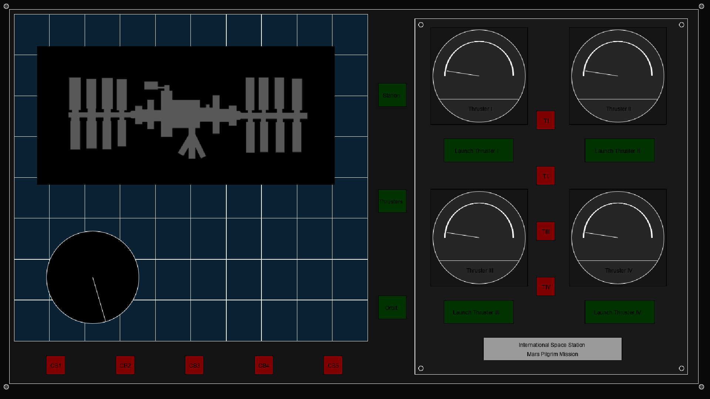
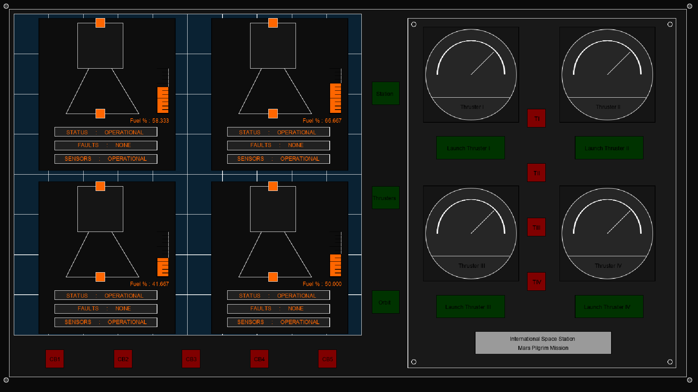
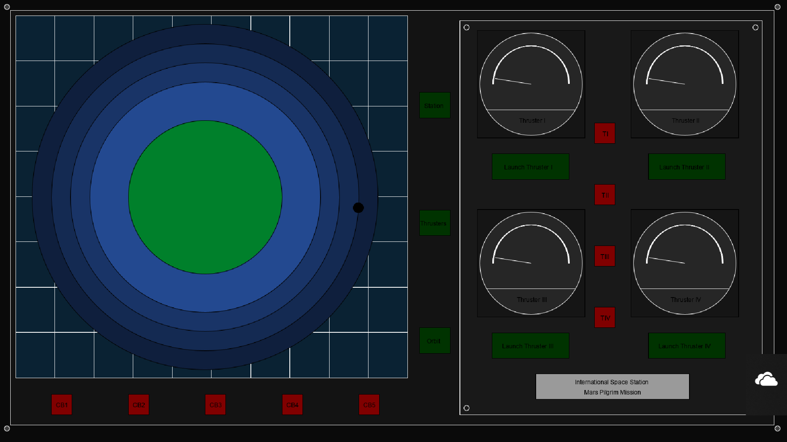
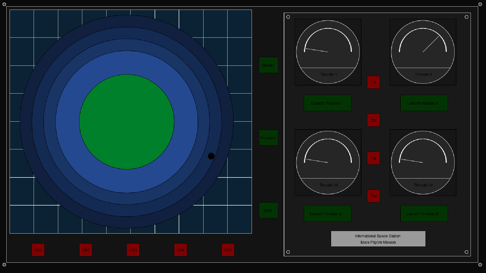
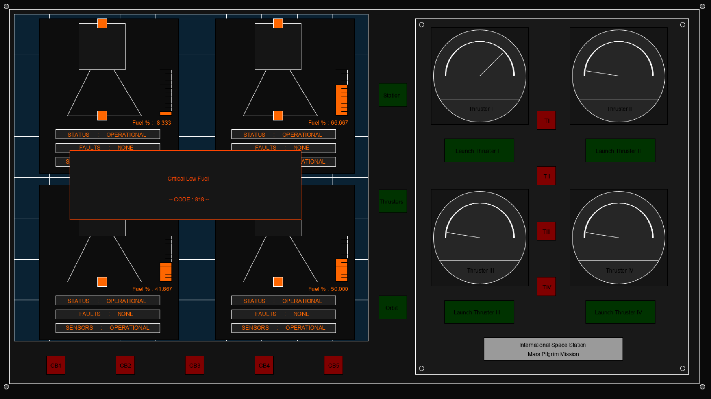
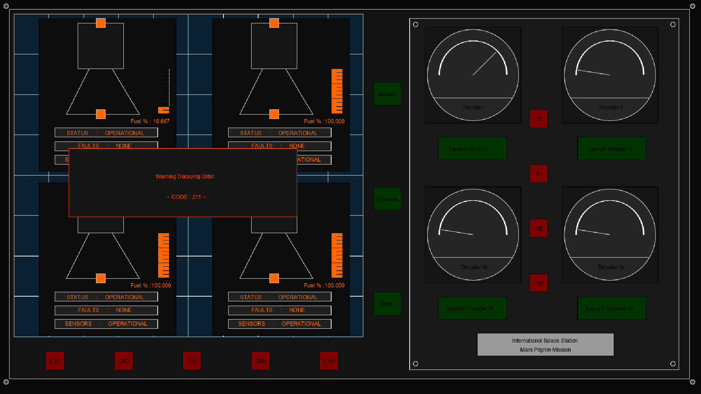

# SciFi UI Project

Name: Aoife Tooomey

Student Number: C17342383

# Description of the assignment
The main idea of the assignment was a spaceship interface that controls the thrusters of the ship. 
The dial panels and buttons control thr measure of the tempature of the thrusters which shows whether they
are currently in use or not.
The main buttons switch between screens which give some information either about the station, thruster, or ship orbiting the earth.
Some of the buttons are there only for aesthetic purposes.
I had wanted to add an alien that seemingly when it climbed into the thrusters to try get aboard the ship would raise the tempature slightly
signaling to the crew where it was ans they try to blast it out - this was based on the SciFi movie 'Life', - however i found this quite 
difficult to implement. I did leave the code there and some is commented out as it effects the implementation of the rest of the code.
There are some files that I created but in the end decided not to use, in relation to the Planets.java and the PlanetsMap, at the start i had decided to do a project featuring the planets and calculate their actual distance fom each other and speed around the sun and if you clicked on them information would display but a fellow classmate was doing something similar to I decided to choose another idea.

# Instructions
The interface open on the station panel screen and the Thruster dial panels (the thruster dial panels are are stationary and always present physically, whereas the screen is supposed to represent a screen and changes).
There are 3 buttons to the right side of the screen, Station, Thrusters and Orbit - when you click on these buttons you switch back and forth between the screen displaying certain information about each.
The thruster dial panels : under each dial is a 'Launch' button when you press this the dial goes up to signal an increase in heat, in the middle of the four dial there are four buttons these are to turn off the Thrusters. The thruster are labelled I, II, III, and IV aswell as the buttons so 
you know which is relating to which.
If you are on the Thruster screen while pressing the Launch buttons then you will see the fuel of each thruster dercrease. 
When the Thruster fuel level get low a warning will come up.
If you are on the Orbit page when you press the launch buttons you will see the black circle representing the ship moving towards the large green circle - by launching the thrusters you are causing the ship to decay back into earths orbit, when you are getting too close a warning will appear.

# How it works
1. The Buttons -  the buttons are calculated by seeing if the mouseX is in to the start of the button and less that the button width, then the mouseY sees if the button is down to the button and between the button height it also uses mod and add a gap + button height again to see which button you are at. Usually this code has an if statement under it to do a certain thing depending on the answer on the varible given.
This is code sample for the panel buttons:

```Java
    //Panel buttons
    int which1 = -1;
        
    if ((mouseX > pborder && mouseX < pborder + pbuttonWidth))
    {
        if (((mouseY - pborder2) % (buttonHeight + pgap)) < buttonHeight)
        {
            which1 = (int) ((mouseY - pborder2) / (buttonHeight + pgap));
            System.out.println(" which1 : " + which1);
        }
    }

    if (which1 != -1 )
    {
        if(which1 == 0 )
        {
            System.out.println("Station");
            choose = 0;
		}
	}
```


2. Thrusters - The two most important classes in relation to the thruster are Thruster.java and SpeedCircle.java(a more appropriate name would probably be Tempcircle but I only remembered it was temapture later). The thruster implements render(), update() and check(). The render draw the thruster, the update changes the information on the thruster and the check() checks whether the fuel is low enough to prompt a warning.
```Java
    public void update()
    {
        down = down - downgap;
        downy = downy + downgap;
        fuel = fuel - downgap;
    }
```

```Java
    public int check()
    {
        float ch = 241;
        float ch1 = 601;
        float ch2 = 249;
        float ch3 = 609;
        if((int)downy >= ch2 && downy <509 )
        {
            downy = 0;
            downgap = 0;

        }
        if((int)downy >= ch3 )
        {
            downy = 0;
            downgap = 0;

        }
        if((int)downy == ch || (int)downy == ch1)
        {
            //System.out.println("YAY");
            return 1;
        }
        else{
            return 0;
        }
    }
```



The SpeedCircle has render(), update(), stop() and alien(). The render method draws the dials and the look of the gauge. The update() updates the angle of the dial when the 'Launch' button is pressed. The stop() reverts the dial to its original position when the stop buttons are pressed and the alien() is supposed to change the dial to represent the alien climbing into the thruster but the code calling it is commented out in UI.java
```Java
    public void update()
    {
        this.x=(int) Math.sin(rotation);
        this.y = (int) -(float) Math.cos(rotation);
        rotation += 0.000000000000001f;

        while(arcAngle != 0)
        {
            arcAngle = arcAngle + 1;
        }
    }
```
```Java
    public void stop( int s)
    {
        if(s == 1)
        {
            arcAngle = 180;
        }
    }
```

3. Orbit - The orbit consists of ellipses drawn over each other, this is detremental as the ship disappears but I could not think of another way to implement it. The render() draws the circles that represent each stage of the atmosphere around earth, the update() makes the small black circle that represnts the ship rotate around the earth and the decay() implements the movement closer to each each time the 'Launch' is pressed.

```Java
    public void update()
    {
        this.x=(int) Math.sin(rotation);
        this.y = (int) -(float) Math.cos(rotation);
        rotation += 0.001f;

    }
```

```Java
    public int decay()
    {
        decay = decay -1;

        if(decay <= x - 110)
        {
            return 1;
        }
        else{
            return 0;
        }
    }
```



4. Warnings - The warnings are quite simple, the values are passed in and then the render() implements the drawing of the shape and prints the text.
```Java
    public void render()
    {
        ui.noFill();
        ui.stroke(255, 69, 0);
        ui.fill(22, 22, 22);
        ui.rect(x - (width/2), y -(height/2), width, height);
        ui.fill(255, 69, 0);
        ui.textAlign(PApplet.CENTER, PApplet.CENTER);
        ui.text(text , x + width * 0.02f, y - height * 0.1f);
        ui.text(text2 , x + width * 0.02f, y + height * 0.2f);
	}
```



# What I am most proud of in the assignment
I think what i'm most proud of is the thruster connectivity. I felt a sense of accomplishment when I saw the fuel decrease as you pressed the button. The dial angle was very difficult to implement, aswell as the whole dial itself. It was like a rotation of a whole circle but you want a start and stop point.

# YouTube Video Link
This is the youtube video for my project:

[](https://youtu.be/MiFeavigzzA)
[](https://youtu.be/MiFeavigzzA)


[](https://www.youtube.com/watch?v=J2kHSSFA4NU)


